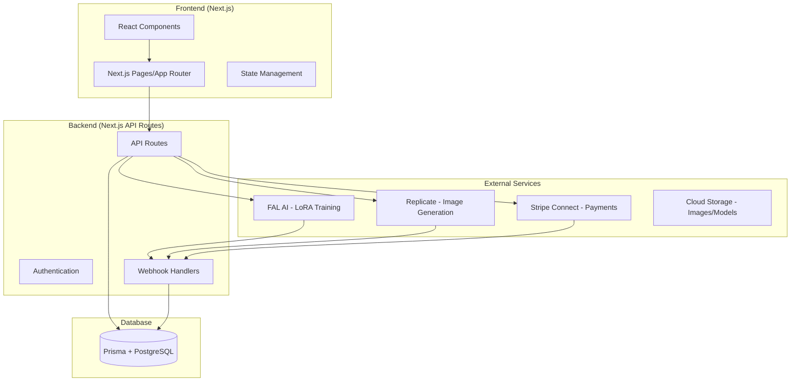
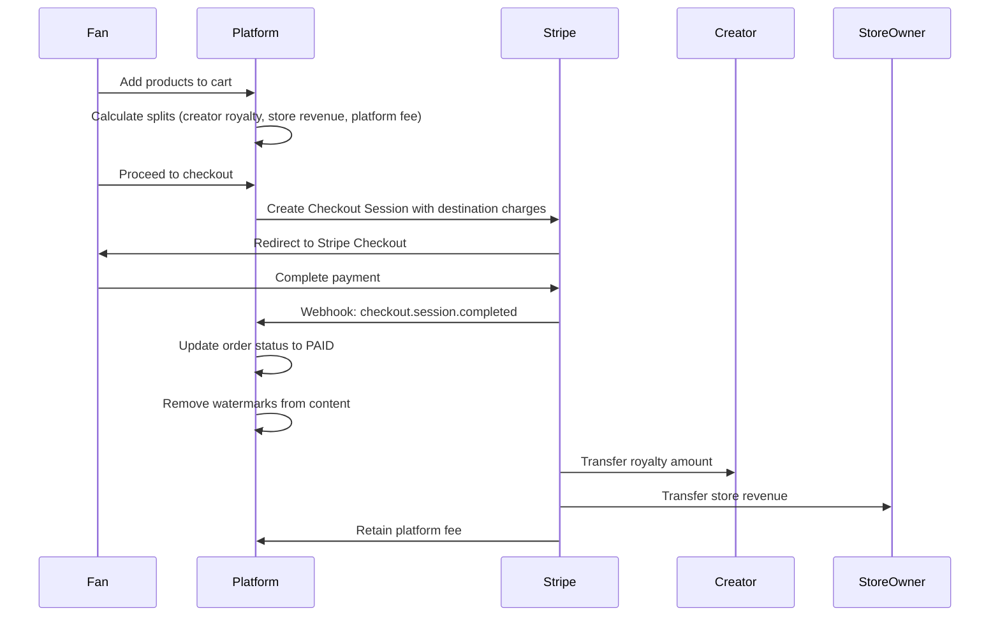
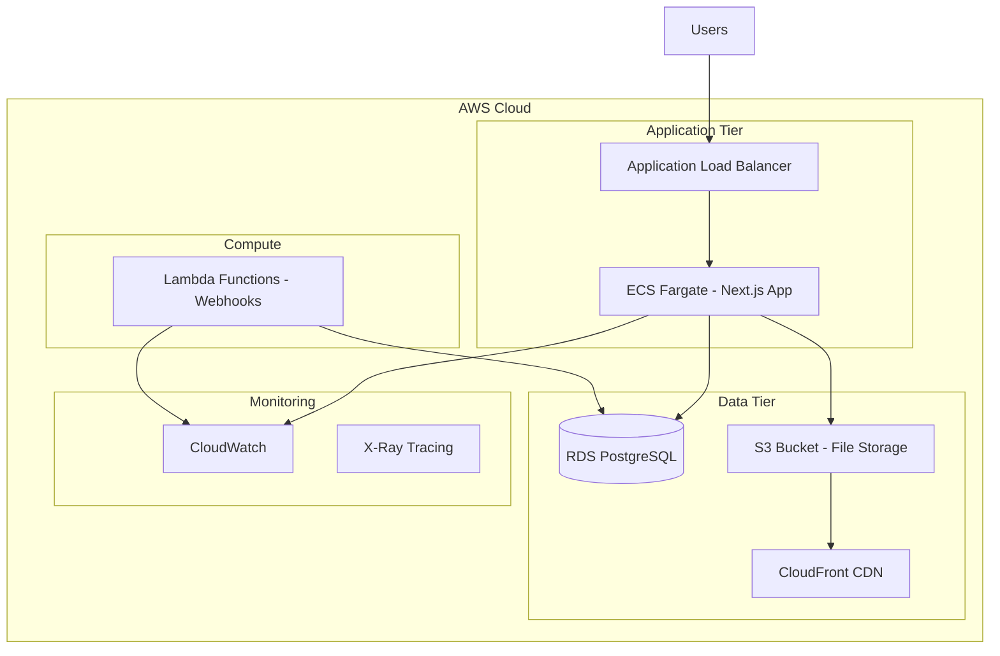

# Design Document

## Overview

The Cameo Ecosystem is a full-stack web application built with Next.js and Prisma that enables creator-branded content generation and merchandise sales. The system integrates with FAL for LoRA training, Replicate for image generation, and Stripe Connect for multi-party payments. The architecture supports real-time content generation, licensing management, and e-commerce workflows.

## Architecture

### High-Level Architecture



### Technology Stack

- **Frontend**: Next.js 14+ with App Router, React, TypeScript, Tailwind CSS
- **Backend**: Next.js API Routes, TypeScript
- **Database**: PostgreSQL with Prisma ORM (AWS RDS)
- **Authentication**: NextAuth.js or Clerk
- **File Storage**: AWS S3 with CloudFront CDN
- **AI Services**: FAL AI, Replicate
- **Payments**: Stripe Connect
- **Deployment**: AWS (EC2/ECS/Lambda) with Application Load Balancer

## Components and Interfaces

### Core Components

#### 1. Creator Management System
- **Creator Profile Component**: Manages creator information, LoRA status, and licensing settings
- **LoRA Training Interface**: Handles image uploads and training job management
- **Licensing Configuration**: UI for setting royalty rates, pricing limits, and store permissions

#### 2. Content Generation Engine
- **Photo Mode Generator**: Interface for scene upload and Kontext LoRA processing
- **Text Mode Generator**: Prompt input and FLUX T2I generation
- **Generation Queue Manager**: Handles job status and webhook processing

#### 3. Merchandise System
- **Product Template Engine**: Applies generated images to merchandise templates
- **Preview Generator**: Creates realistic product mockups
- **Inventory Management**: Tracks available products and customization options

#### 4. Store Management
- **Store Builder**: Interface for creating and managing storefronts
- **Product Listing Manager**: Handles product curation and licensing compliance
- **Revenue Dashboard**: Displays sales analytics and royalty tracking

#### 5. Checkout and Payment System
- **Shopping Cart**: Manages selected products and pricing
- **Stripe Connect Integration**: Handles destination charges and multi-party split payments
- **Royalty Distribution Engine**: Calculates and processes creator royalties and platform fees
- **Order Management**: Tracks order status, payment splits, and fulfillment

### API Interface Design

#### Creator APIs
```typescript
// POST /api/creator
interface CreateCreatorRequest {
  name: string;
  images: File[];
  consent: boolean;
  licensing: LicensingConfig;
}

// GET /api/creator/[id]/lora-status
interface LoRAStatusResponse {
  status: 'training' | 'ready' | 'failed';
  lora_url?: string;
  trigger_word?: string;
  progress?: number;
}
```

#### Generation APIs
```typescript
// POST /api/generate
interface GenerateRequest {
  mode: 'photo' | 'text';
  creator_id: string;
  prompt?: string;
  scene_image?: string;
  lora_url: string;
}

// POST /api/3d
interface Generate3DRequest {
  image_url: string;
}
```

#### Store APIs
```typescript
// POST /api/store
interface CreateStoreRequest {
  name: string;
  description: string;
  owner_id: string;
}

// POST /api/store/[id]/products
interface AddProductRequest {
  image_url: string;
  creator_id: string;
  product_type: 'postcard' | 'shirt' | 'figurine';
  price_cents: number;
}
```

#### Payment APIs
```typescript
// POST /api/checkout
interface CheckoutRequest {
  items: {
    product_id: string;
    quantity: number;
  }[];
  success_url: string;
  cancel_url: string;
}

interface CheckoutResponse {
  session_id: string;
  url: string;
}

// POST /api/webhooks/stripe
interface StripeWebhookPayload {
  type: 'checkout.session.completed' | 'transfer.created' | 'payout.paid';
  data: {
    object: any;
  };
}
```

## Data Models

### Database Schema

```prisma
model Creator {
  id            String   @id @default(cuid())
  name          String
  email         String   @unique
  lora_url      String?
  trigger_word  String?
  status        LoRAStatus @default(PENDING)
  
  // Stripe Connect integration
  stripe_account_id       String? @unique
  stripe_onboarding_complete Boolean @default(false)
  
  // Licensing configuration
  allow_third_party_stores Boolean @default(true)
  royalty_bps             Int     @default(1000) // 10%
  min_price_cents         Int     @default(500)   // $5.00
  max_discount_bps        Int     @default(2000)  // 20%
  
  createdAt     DateTime @default(now())
  updatedAt     DateTime @updatedAt
  
  generations   Generation[]
  products      Product[]
  royalties     Royalty[]
  transfers     Transfer[]
}

model Generation {
  id          String @id @default(cuid())
  creator_id  String
  user_id     String
  mode        GenerationMode
  prompt      String?
  scene_url   String?
  image_url   String?
  status      JobStatus @default(PENDING)
  
  creator     Creator @relation(fields: [creator_id], references: [id])
  user        User    @relation(fields: [user_id], references: [id])
  products    Product[]
  
  createdAt   DateTime @default(now())
  updatedAt   DateTime @updatedAt
}

model Store {
  id          String @id @default(cuid())
  name        String
  description String?
  owner_id    String
  
  // Stripe Connect integration for store owners
  stripe_account_id String? @unique
  
  owner       User @relation(fields: [owner_id], references: [id])
  products    Product[]
  transfers   Transfer[]
  
  createdAt   DateTime @default(now())
  updatedAt   DateTime @updatedAt
}

model Product {
  id            String @id @default(cuid())
  store_id      String
  generation_id String
  creator_id    String
  product_type  ProductType
  price_cents   Int
  status        ProductStatus @default(ACTIVE)
  
  store         Store      @relation(fields: [store_id], references: [id])
  generation    Generation @relation(fields: [generation_id], references: [id])
  creator       Creator    @relation(fields: [creator_id], references: [id])
  orders        OrderItem[]
  
  createdAt     DateTime @default(now())
  updatedAt     DateTime @updatedAt
}

model Order {
  id                String @id @default(cuid())
  user_id           String
  stripe_session_id String? @unique
  stripe_payment_intent_id String?
  status            OrderStatus @default(PENDING)
  total_cents       Int
  platform_fee_cents Int
  
  user              User @relation(fields: [user_id], references: [id])
  items             OrderItem[]
  royalties         Royalty[]
  transfers         Transfer[]
  
  createdAt         DateTime @default(now())
  updatedAt         DateTime @updatedAt
}

model OrderItem {
  id         String @id @default(cuid())
  order_id   String
  product_id String
  quantity   Int @default(1)
  price_cents Int
  
  order      Order   @relation(fields: [order_id], references: [id])
  product    Product @relation(fields: [product_id], references: [id])
}

model Royalty {
  id          String @id @default(cuid())
  order_id    String
  creator_id  String
  amount_cents Int
  status      RoyaltyStatus @default(PENDING)
  
  order       Order   @relation(fields: [order_id], references: [id])
  creator     Creator @relation(fields: [creator_id], references: [id])
  
  createdAt   DateTime @default(now())
  updatedAt   DateTime @updatedAt
}

model Transfer {
  id                String @id @default(cuid())
  order_id          String
  stripe_transfer_id String? @unique
  recipient_type    TransferRecipient
  creator_id        String?
  store_id          String?
  amount_cents      Int
  status            TransferStatus @default(PENDING)
  
  order             Order    @relation(fields: [order_id], references: [id])
  creator           Creator? @relation(fields: [creator_id], references: [id])
  store             Store?   @relation(fields: [store_id], references: [id])
  
  createdAt         DateTime @default(now())
  updatedAt         DateTime @updatedAt
}

enum LoRAStatus {
  PENDING
  TRAINING
  READY
  FAILED
}

enum GenerationMode {
  PHOTO
  TEXT
}

enum JobStatus {
  PENDING
  PROCESSING
  COMPLETED
  FAILED
}

enum ProductType {
  POSTCARD
  SHIRT
  FIGURINE
}

enum ProductStatus {
  ACTIVE
  INACTIVE
  OUT_OF_STOCK
}

enum OrderStatus {
  PENDING
  PAID
  PROCESSING
  SHIPPED
  DELIVERED
  CANCELLED
}

enum RoyaltyStatus {
  PENDING
  PAID
  FAILED
}

enum TransferRecipient {
  CREATOR
  STORE_OWNER
}

enum TransferStatus {
  PENDING
  PROCESSING
  COMPLETED
  FAILED
}
```

## Payment & Royalty Distribution

### Stripe Connect Integration

The system integrates with **Stripe Connect** for multi-party split payments, enabling automatic royalty distribution to creators and revenue sharing with store owners.

#### Payment Flow Architecture



#### Implementation Details

**1. Checkout Session Creation**
```typescript
// When Fan purchases merchandise
const session = await stripe.checkout.sessions.create({
  payment_method_types: ['card'],
  line_items: lineItems,
  mode: 'payment',
  success_url: `${domain}/success?session_id={CHECKOUT_SESSION_ID}`,
  cancel_url: `${domain}/cancel`,
  
  // Destination charges for multi-party payments
  payment_intent_data: {
    application_fee_amount: platformFeeAmount,
    transfer_group: orderId,
  },
  
  // Metadata for tracking
  metadata: {
    order_id: orderId,
    creator_ids: JSON.stringify(creatorIds),
    store_owner_id: storeOwnerId,
  }
});
```

**2. Webhook Processing**
```typescript
// Handle checkout.session.completed webhook
if (event.type === 'checkout.session.completed') {
  const session = event.data.object;
  
  // Update order status
  await prisma.order.update({
    where: { stripe_session_id: session.id },
    data: { 
      status: 'PAID',
      stripe_payment_intent_id: session.payment_intent 
    }
  });
  
  // Remove watermarks from generated content
  await removeWatermarks(orderId);
  
  // Create transfers for creators and store owners
  await processRoyaltyTransfers(orderId, session.payment_intent);
}
```

**3. Royalty Transfer Processing**
```typescript
async function processRoyaltyTransfers(orderId: string, paymentIntentId: string) {
  const order = await getOrderWithItems(orderId);
  
  for (const item of order.items) {
    const creator = item.product.creator;
    const store = item.product.store;
    
    // Calculate royalty amount
    const royaltyAmount = Math.floor(
      (item.price_cents * creator.royalty_bps) / 10000
    );
    
    // Transfer to creator
    if (creator.stripe_account_id && royaltyAmount > 0) {
      const transfer = await stripe.transfers.create({
        amount: royaltyAmount,
        currency: 'usd',
        destination: creator.stripe_account_id,
        transfer_group: orderId,
        metadata: {
          order_id: orderId,
          creator_id: creator.id,
          type: 'royalty'
        }
      });
      
      // Log transfer in database
      await prisma.transfer.create({
        data: {
          order_id: orderId,
          stripe_transfer_id: transfer.id,
          recipient_type: 'CREATOR',
          creator_id: creator.id,
          amount_cents: royaltyAmount,
          status: 'PROCESSING'
        }
      });
    }
    
    // Calculate store owner revenue (remaining after royalty and platform fee)
    const storeRevenue = item.price_cents - royaltyAmount - platformFee;
    
    // Transfer to store owner
    if (store.stripe_account_id && storeRevenue > 0) {
      const transfer = await stripe.transfers.create({
        amount: storeRevenue,
        currency: 'usd',
        destination: store.stripe_account_id,
        transfer_group: orderId,
        metadata: {
          order_id: orderId,
          store_id: store.id,
          type: 'store_revenue'
        }
      });
      
      // Log transfer in database
      await prisma.transfer.create({
        data: {
          order_id: orderId,
          stripe_transfer_id: transfer.id,
          recipient_type: 'STORE_OWNER',
          store_id: store.id,
          amount_cents: storeRevenue,
          status: 'PROCESSING'
        }
      });
    }
  }
}
```

#### Creator Onboarding Requirements

**Stripe Account Validation**
- Creators MUST complete Stripe Connect onboarding before products can be listed
- System blocks product listing until `stripe_onboarding_complete = true`
- Periodic verification of account status via Stripe API

**Onboarding Flow**
```typescript
// Create Stripe Connect account for creator
const account = await stripe.accounts.create({
  type: 'express',
  country: 'US',
  email: creator.email,
  capabilities: {
    transfers: { requested: true }
  }
});

// Create onboarding link
const accountLink = await stripe.accountLinks.create({
  account: account.id,
  refresh_url: `${domain}/creator/onboarding/refresh`,
  return_url: `${domain}/creator/onboarding/complete`,
  type: 'account_onboarding'
});
```

#### Compliance and Auditing

**Transaction Logging**
- All payment splits logged in `transfers` table with Stripe transfer IDs
- Royalty calculations stored for audit trail
- Platform fee tracking for financial reporting

**Dispute Handling**
- Stripe Connect handles chargebacks and disputes
- Platform provides transaction history for dispute resolution
- Creator and store owner notification system for payment issues

**Tax Reporting**
- 1099 generation for creators earning over threshold
- Transaction export for accounting integration
- Revenue reporting by creator, store, and time period

## Error Handling

### Error Categories

1. **Validation Errors**: Input validation, file format checks, licensing violations
2. **External Service Errors**: FAL/Replicate API failures, Stripe payment issues
3. **Business Logic Errors**: Licensing violations, insufficient funds, content policy violations
4. **System Errors**: Database failures, network timeouts, storage issues

### Error Response Format

```typescript
interface ErrorResponse {
  error: {
    code: string;
    message: string;
    details?: any;
    retry_after?: number;
  };
}
```

### Retry and Fallback Strategies

- **Generation Jobs**: Automatic retry with exponential backoff (max 3 attempts)
- **Webhook Processing**: Dead letter queue for failed webhooks
- **Payment Processing**: Stripe automatic retry handling
- **File Uploads**: Chunked upload with resume capability

## Testing Strategy

### Unit Testing
- **Models**: Prisma model validation and business logic
- **API Routes**: Request/response handling and error cases
- **Components**: React component behavior and user interactions
- **Utilities**: Helper functions and data transformations

### Integration Testing
- **External APIs**: Mock FAL, Replicate, and Stripe responses
- **Database Operations**: Test Prisma queries and transactions
- **Webhook Handling**: Simulate external service callbacks
- **File Upload/Storage**: Test complete upload workflows

### End-to-End Testing
- **Creator Onboarding**: Complete LoRA training workflow
- **Content Generation**: Photo and text mode generation flows
- **Purchase Flow**: Complete checkout and payment processing
- **Store Management**: Store creation and product listing

### Performance Testing
- **Generation Speed**: Ensure sub-0.5s 3D generation requirement
- **Concurrent Users**: Load testing for multiple simultaneous generations
- **Database Performance**: Query optimization and indexing
- **File Storage**: Upload/download performance testing

### Security Testing
- **Authentication**: JWT validation and session management
- **Authorization**: Creator licensing and store permissions
- **Input Validation**: SQL injection, XSS prevention
- **Content Safety**: NSFW detection and keyword filtering

## Deployment and Infrastructure

### AWS Architecture



### Environment Configuration
- **Development**: Local PostgreSQL, LocalStack for AWS services, mock external APIs
- **Staging**: AWS RDS (t3.micro), S3 staging bucket, sandbox external services
- **Production**: AWS RDS (Multi-AZ), S3 with versioning, production external services

### AWS Services Integration
- **ECS Fargate**: Container orchestration for Next.js application
- **RDS PostgreSQL**: Managed database with automated backups
- **S3**: File storage for images, LoRA models, and generated content
- **CloudFront**: CDN for fast global content delivery
- **Lambda**: Serverless webhook processing for external service callbacks
- **Application Load Balancer**: Traffic distribution and SSL termination
- **CloudWatch**: Application and infrastructure monitoring
- **X-Ray**: Distributed tracing for performance optimization

### Security Configuration
- **VPC**: Private subnets for database and application tiers
- **Security Groups**: Restrictive inbound/outbound rules
- **IAM Roles**: Least privilege access for services
- **S3 Bucket Policies**: Secure file access with signed URLs
- **SSL/TLS**: End-to-end encryption with AWS Certificate Manager

### Monitoring and Observability
- **CloudWatch Metrics**: Response times, error rates, generation success rates
- **CloudWatch Logs**: Centralized application and system logs
- **X-Ray Tracing**: Request flow analysis and bottleneck identification
- **Business Metrics**: Creator signups, generation volume, revenue tracking
- **External Service Monitoring**: FAL/Replicate API health and latency
- **Database Monitoring**: RDS Performance Insights for query optimization